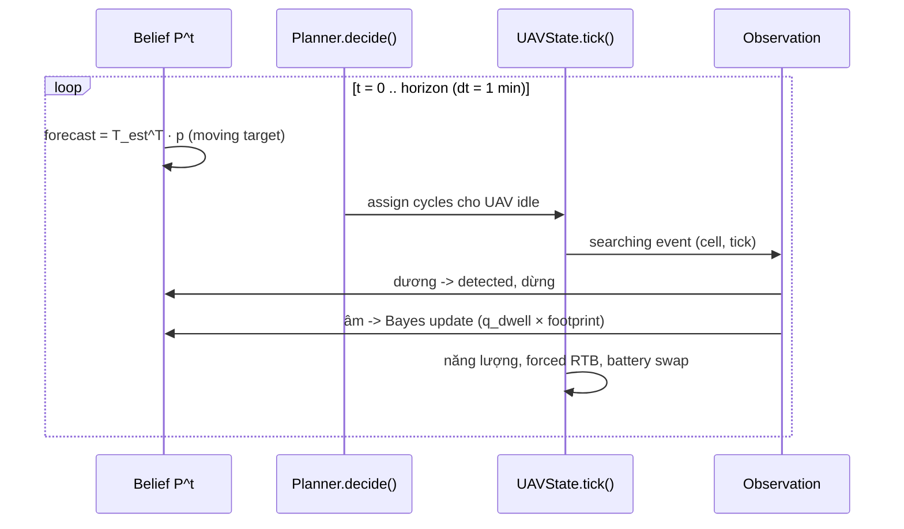

# Kiến trúc hệ thống

## Luồng dữ liệu tổng thể

```mermaid
flowchart TD
    subgraph DATA["Lớp dữ liệu"]
        A[AreaData<br/>grid + elevation/slope/rugged/<br/>veg/trails/water/dist_trail]
        W[WeatherSeries<br/>cloud/rain/wind/temp theo tick]
    end

    subgraph TRUTH["Ground truth (ẨN với planner)"]
        T[LostPersonSim<br/>profile hiker/desormented/<br/>injured/photographer]
        TP[target_path<br/>mỗi tick tuyệt đối]
    end

    subgraph BELIEF["Thế giới thông tin của planner I_t"]
        B0[Initial belief<br/>uniform/distance/gis/datadriven]
        MM[MotionModel ước lượng<br/>forecast T^T · p]
        BU[Bayes negative update]
    end

    subgraph PLAN["Planner (chỉ nhìn belief)"]
        PP[PlanningProblem:<br/>V_ikt = p_i^t · q_ikt]
        PL{Planner}
        GR[greedy / greedy_ratio]
        ST[static multi-cycle<br/>insertion + diffusion discount]
        RO[rolling-horizon<br/>lookahead cells]
        MI[milp tuỳ chọn]
    end

    subgraph SIM["Mô phỏng vận hành"]
        US[UAVState<br/>fly/search/rtb/swap]
        EN[Năng lượng γd+ηclimb,<br/>ατ, reserve, swap pin]
        OBS[Observation<br/>Bernoulli q_tick<br/>footprint ±8 ô kề]
    end

    MET[MissionResult → DSR, EDT,<br/>P(T≤deadline), distance,<br/>energy, redundancy, replans]

    A --> B0
    A --> MM
    A --> T
    W --> T
    W --> OBS
    B0 --> PP
    MM --> PP
    MM --> MM2[forecast mỗi tick]:::hidden
    PP --> PL
    PL --> GR & ST & RO & MI
    PL -->|cycles (cell,dwell)| US
    US --> EN
    US --> OBS
    TP --> OBS
    T --> TP
    OBS -->|âm| BU --> MM
    OBS -->|dương| DETECTED[detect_time]
    US --> MET
    DETECTED --> MET
```

## Nguyên tắc cách ly thông tin

Đề cương nhấn mạnh hộp *"Vị trí thực ≠ belief của planner"* — kiến trúc ép
buộc điều này bằng cấu trúc module:

1. `MissionSetup.create()` sinh **toàn bộ** trajectory mục tiêu TRƯỚC khi
   mission bắt đầu (CRN — common random numbers giữa các arm).
2. `run_mission()` chỉ đọc `setup.target_path[tabs]` tại khoảnh khắc vẽ
   quan sát; planner nhận duy nhất mảng `belief`.
3. `PlanningProblem` không chứa tham chiếu tới target; chỉ có area, fleet,
   motion model *ước lượng*, weather accessor.

## Vòng lặp mission (mỗi decision tick)



## Planner ladder (đúng thứ tự đề cương)

| Planner | Thông tin dùng | Khi nào replan |
|---|---|---|
| `greedy` | p·q hiện tại | mỗi khi idle (1 ô) |
| `static` | diffusion-discounted gain tại t₀ | **một lần** đầu mission (open-loop, multi-cycle qua các lần swap pin) |
| `rolling` | posterior mới nhất | mỗi khi idle (multi-cell cycle, lookahead) |
| `milp` | p·q + ràng buộc thời gian | như rolling, chọn cell bằng CBC |

Static vs rolling chính là trục A/B/C/D của RQ4; greedy là baseline dưới cùng.

## Đơn vị & tham số mặc định

* dt = 1 phút; horizon 180 phút; burn-in 30–90 phút trước mission.
* Cell 100 m, grid 40×40 (4 km × 4 km).
* UAV: 13 m/s, pin ~88–92 Wh (~28 phút endurance), swap 4 phút.
* Dwell 3 tick/cell; q_tick RGB 0.30 / thermal 0.26 gốc, suy giảm theo
  vegetation/cloud/rain (RGB mạnh hơn thermal dưới tán rừng).
