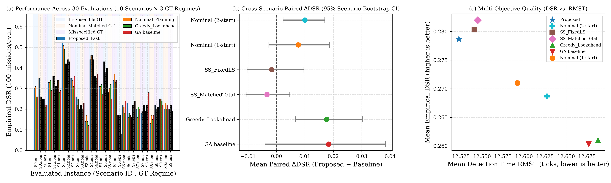
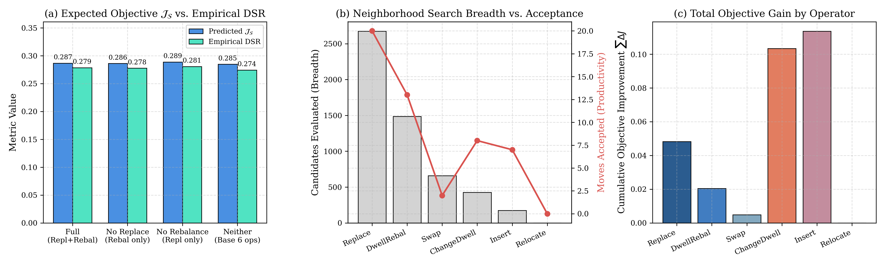

# Phân tích Kết quả và Thiết kế Thực nghiệm Chuẩn tắc

## 1. Nguồn và Phạm vi Dữ liệu Thực nghiệm

Bản phân tích này chuẩn hóa toàn bộ hệ thống thực nghiệm của khóa luận theo thiết kế tách bạch (Decoupled Factorial Design), phân định độc lập đóng góp của **mô hình ensemble**, **chiến lược tìm kiếm multi-start**, và **từng toán tử láng giềng**.

Dữ liệu nền tảng sử dụng run benchmark chuẩn hóa tại [kết quả chính thức](../results/multi_instance_tier3_results.json) và [nghiên cứu thứ tự toán tử](../results/operator_order_study_results.json):
- **Tính xác định & Tái lập Đa tiến trình (Deterministic Seeding)**: Toàn bộ quá trình sinh đường đi ngẫu nhiên sử dụng ánh xạ seed cố định `get_regime_seed_offset()` độc lập hoàn toàn với `PYTHONHASHSEED` của môi trường thực thi.
- **Quy mô mẫu đánh giá và Phân cấp Độc lập**:
  - Số kịch bản địa hình/thời tiết độc lập: $N_{\text{unique\_scenarios}} = 10$.
  - Số thiết kế bài toán: $N_{\text{designs}} = 10$.
  - Số đơn vị đánh giá Ground Truth: $N_{\text{evaluations}} = 30$ ($10 \text{ kịch bản} \times 3 \text{ chế độ Ground Truth}$).
  - Tổng số mission mô phỏng: $30 \times 100 = \mathbf{3.000\text{ missions}}$ cho mỗi phương pháp.
- **Tính nhất quán phương sai (Common Random Numbers - CRN)**: Các phương pháp trong cùng một kịch bản và cùng một chế độ Ground Truth dùng chung chính xác tập đường đi mục tiêu ngẫu nhiên.
- **Chuẩn hóa Trọng số Tổng hợp (Equal Scenario Weighting)**: Mọi giá trị trung bình đại diện, khoảng tin cậy và chênh lệch ghép cặp được tính theo nguyên tắc gom trung bình theo từng `scenario_id` trước ($\bar{X}_s$), sau đó lấy trung bình đều qua các kịch bản: $\bar{X} = \frac{1}{N_{\text{scenarios}}} \sum_{s=1}^{N_{\text{scenarios}}} \bar{X}_s$. Quy tắc này đảm bảo các kịch bản luôn có tỷ trọng bằng nhau $1/N_{\text{scenarios}}$ ngay cả khi số lượng replicate không đều.
- **Phương pháp ước lượng độ bất định (Scenario-Level CI)**:
  - **Khoảng tin cậy chính**: *Stratified Scenario Cluster Bootstrap CI 95%* ($B=5.000$ lượt lấy mẫu lại theo cụm `scenario_id` với `equal_group_weight=True`, `alpha=0.05`, `seed=42`).
  - **Khoảng tin cậy tham số**: *Scenario-Aggregated Student's $t$ CI 95%* tính trên giá trị trung bình của $N_{\text{scenarios}}=10$ kịch bản (bậc tự do $\text{df}=9$).

---

## 2. Ma trận Câu hỏi Nghiên cứu (Research Questions - RQ)

Mọi kết luận trong khóa luận được gắn trực tiếp với một thí nghiệm kiểm soát độc lập:

| Mã RQ | Câu hỏi nghiên cứu | Đối chứng kiểm soát | Biến độc lập | Chỉ số chính |
|---|---|---|---|---|
| **RQ1 (Evaluator)** | Fast Evaluator có bảo toàn độ chính xác và giảm runtime/eval so với Prefix-Only và Full không? | Full Evaluator, Prefix-Only, Fast Evaluator trên cùng tập candidate | Độ dài đoạn thay đổi $[t_a, t_b]$ | Sai số tương đối $\|\Delta J\|/J$, Execution time ($\mu s$/eval) |
| **RQ2 (Multi-start)** | Khởi tạo 2-start (Ensemble + Nominal) có cải thiện nghiệm so với Single-start trong cùng tổng ngân sách? | `Proposed_Fast` (300+300) vs `SingleStart_FixedLS` (600) vs `SingleStart_MatchedTotal` (600+init) | Điểm xuất phát & phân bổ ngân sách | Objective $J$, DSR (%), RMST (tick), Tỷ lệ local optimum |
| **RQ3 (Ensemble vs Nominal)** | Tối ưu hóa theo Ensemble có tăng tính bền vững (robustness) khi môi trường thực tế sai lệch? | **Pure Model**: `Proposed_Fast` vs `Nominal_2Start` (cùng solver, cùng 2 start, cùng ngân sách)<br>**Pipeline**: `Proposed_Fast` vs `Nominal_Planning` (1-start) | Mô hình Evaluator (Ensemble vs Nominal); đối đầu qua 3 GT regimes | Ground Truth $J$, Empirical DSR (%), Paired $\Delta$DSR, RMST |
| **RQ4 (Toán tử & Thứ tự)** | Replace và Rebalance đóng góp gì, và thứ tự duyệt toán tử có gây thiên lệch kết luận ablation? | 4 cấu hình ablation $\times$ 3 chế độ thứ tự (`fixed`, `round_robin`, `shuffled`) | Tập toán tử bật/tắt và thứ tự duyệt | Số candidate sinh/khả thi, Tỷ lệ chấp nhận (%), Paired $\Delta J$, Paired $\Delta\text{DSR}$ |
| **RQ5 (Scalability)** | Thời gian lập lịch mở rộng như thế nào theo quy mô bài toán? | Tăng Horizon $H$, số UAV $K$, kích thước lưới $N$ | Quy mô không gian trạng thái | Planning Runtime (s), Peak Memory |

---

## 3. Xác nhận Thực thi & Bộ Kiểm thử

- **Toàn bộ Test Suite**: **102 test đạt** (0 failed, 0 error), bao phủ kiểm tra tái lập bitwise qua các process độc lập (`PYTHONHASHSEED`), kiểm tra tính toàn vẹn của trọng số kịch bản, kiểm tra tính toán CI khi replicate không đều và kiểm tra hành vi thứ tự toán tử.
- **Bản ghi xác nhận**: Được lưu trữ tại [validation_latest.xml](../results/logs/validation_latest.xml).
- **Môi trường thực thi**: Python 3.12, NumPy 2.5.2, SciPy 1.18.1, pytest 8.3.5 trên Windows 11.
- **Lệnh tái lập toàn bộ kết quả**:

```powershell
# 1. Chạy toàn bộ 102 test kiểm thử tự động
.venv/Scripts/python.exe -X utf8 -m pytest -q --junitxml=results/logs/validation_latest.xml

# 2. Chạy benchmark đa kịch bản tách bạch 3 Ground Truth
.venv/Scripts/python.exe -X utf8 scripts/run_multi_instance.py --num-instances 10 --num-missions 100 --operator-order fixed

# 3. Chạy thí nghiệm ma trận thứ tự toán tử (đồng bộ H=15, 10 kịch bản, lưu đầy đủ raw_records)
.venv/Scripts/python.exe -X utf8 scripts/run_operator_order_study.py --H 15 --num-instances 10 --num-missions 100 --master-seed 42

# 4. Xuất biểu đồ phân tích chuẩn luận văn
.venv/Scripts/python.exe -X utf8 scripts/plot_multi_instance_figures.py
```

---

## 4. Kết quả Chính: Phân định Đối chứng Thuần và Đối chứng Pipeline

Tổng hợp trên $N_{\text{scenarios}}=10$ kịch bản $\times$ 3 chế độ Ground Truth = 30 đơn vị đánh giá (3.000 mission/phương pháp), chuẩn hóa theo trọng số kịch bản (`equal_scenario_weight`):

| Nhóm so sánh | Phương pháp | DSR (%) | CI 95% Bootstrap theo Scenario | RMST (tick) | Năng lượng (kJ) | $J$ Ground Truth |
|---|---|---:|:---:|---:|---:|---:|
| **Hệ thống đề xuất** | `Proposed_Fast` (2-start, Ens) | **27,87** | [22,70%; 33,30%] | **12,522** | 280,28 | **0,27249** |
| **Đối chứng Thuần Mô hình** | `Nominal_2Start` (2-start, Nom) | 26,87 | [21,70%; 32,37%] | 12,628 | 282,40 | 0,27072 |
| **Đối chứng Multi-start** | `SingleStart_Fast_FixedLS` | 28,03 | [23,00%; 33,43%] | 12,541 | 279,33 | 0,26350 |
| | `SingleStart_Fast_MatchedTotal` | 28,20 | [23,20%; 33,57%] | 12,545 | 279,41 | 0,26355 |
| **Đối chứng Pipeline truyền thống** | `Nominal_Planning` (1-start) | 27,10 | [22,00%; 32,53%] | 12,592 | 281,66 | 0,26830 |
| **Đối chứng Heuristic / Meta** | `Greedy_Lookahead` | 26,10 | [21,00%; 31,57%] | 12,688 | 275,17 | 0,25044 |
| | `Adaptive_GA` | 26,03 | [21,77%; 30,53%] | 12,677 | 272,13 | 0,25789 |

### Phân tích Khoảng tin cậy Ghép cặp (Paired Differences, ước lượng ở cấp Scenario)

| `Proposed_Fast` trừ đối chứng | Thắng / Thua / Hòa | $\Delta$DSR (điểm %) | CI 95% Cluster Bootstrap | CI 95% Scenario Student's $t$ | $p_{\text{boot}}$ | Diễn giải khoa học & Giới hạn bằng chứng |
|---|:---:|---:|:---:|:---:|:---:|---|
| vs `Nominal_2Start` | 19 / 10 / 1 | **+1,00** | [+0,23; +1,70] | [+0,10; +1,90] | 0,0144 | **Thuần mô hình**: Tối ưu hóa theo mô hình Ensemble đem lại cải thiện có ý nghĩa thống kê về DSR (+1,00%, $p < 0,05$) và giảm RMST (−0,105 tick) so với mô hình danh định khi cố định cùng ngân sách và số lần khởi động. |
| vs `SingleStart_Fast_FixedLS` | 11 / 13 / 6 | **−0,17** | [−1,03; +0,97] | [−1,38; +1,05] | 0,6804 | **Multi-start**: Chưa phát hiện khác biệt có ý nghĩa thống kê về DSR giữa 2-start và 1-start trên tập kịch bản này (khoảng tin cậy bao quanh 0, $p=0,68$). Cần lưu ý: việc không phát hiện khác biệt không đồng nghĩa với chứng minh hai phương pháp tương đương tuyệt đối. |
| vs `SingleStart_Fast_MatchedTotal` | 10 / 14 / 6 | **−0,33** | [−1,07; +0,47] | [−1,25; +0,58] | 0,3844 | Khi bù đắp chi phí khởi tạo, DSR của 2-start và 1-start trên bộ mẫu này ở mức tương cận, chưa ghi nhận ưu thế vượt trội của 2-start trên thước đo DSR cuối cùng. |
| vs `Nominal_Planning` (1-start) | 18 / 12 / 0 | **+0,77** | [−0,27; +1,87] | [−0,53; +2,06] | 0,1588 | Quan sát thấy xu hướng Proposed nhỉnh hơn về DSR (+0,77%) và RMST (−0,070 tick), nhưng độ biến thiên giữa các kịch bản khiến khoảng tin cậy 95% vẫn chứa giá trị 0. |
| vs `Greedy_Lookahead` | 21 / 8 / 1 | **+1,77** | [+0,67; +3,03] | [+0,34; +3,19] | 0,0004 | Thuật toán Local Search cải thiện rõ rệt và có ý nghĩa thống kê cao ($p < 0,001$) so với khởi tạo tham lam đơn thuần. |
| vs `Adaptive_GA` | 19 / 10 / 1 | **+1,83** | [−0,40; +3,83] | [−0,71; +4,38] | 0,1052 | Quan sát thấy Proposed đạt DSR cao hơn (+1,83%), tuy nhiên GA có phương sai lớn giữa các kịch bản khiến CI chưa hoàn toàn loại trừ giá trị 0. |

---

## 5. Phân tích Tách bạch theo 3 Chế độ Ground Truth

Trong thiết kế tách bạch, **tất cả 10 kịch bản đều được đánh giá độc lập qua cả 3 chế độ Ground Truth** ($10 \times 3 = 30$ lượt đánh giá, mỗi lượt 100 mission), cho phép phân tích riêng tính ổn định của từng phương pháp:

| Chế độ Ground Truth | Số kịch bản | DSR Proposed (%) | DSR `Nominal_2Start` (%) | $\Delta\text{DSR}$ (Proposed vs Nom2Start) | CI 95% Student's $t$ $\Delta\text{DSR}$ | CI 95% Bootstrap $\Delta\text{DSR}$ | Nhận định Động lực học & Giới hạn Thống kê |
|---|---:|---:|---:|---:|:---:|:---:|---|
| **Trong Ensemble (In-Ensemble)** | 10 | **30,60** | 29,80 | **+0,80%** (RMST −0,112 tick) | [−2,10%; +3,70%] | [−1,60%; +3,20%] | Mục tiêu di chuyển trong không gian giả thuyết $\Theta$: Quan sát thấy mức tăng DSR +0,80%. |
| **Khớp Nominal (Nominal-Matched)** | 10 | **27,40** | 26,90 | **+0,50%** (RMST −0,052 tick) | [−1,35%; +2,35%] | [−0,90%; +1,90%] | Mục tiêu di chuyển khớp đúng mô hình danh định: Hiệu năng hai phương pháp duy trì ở mức tương đương. |
| **Sai đặc tả (Misspecified)** | 10 | **25,60** | 23,90 | **+1,70%** (RMST −0,152 tick) | [−1,00%; +4,40%] | [−0,40%; +3,80%] | Mục tiêu trôi dạt ra ngoài $\Theta$: Quan sát thấy mức sụt giảm của Proposed thấp hơn (+1,70% DSR so với Nominal_2Start). |

> [!NOTE]
> **Nhận định khoa học cho khóa luận**:
> - Trên bộ 3.000 mission khảo sát, quan sát thấy chênh lệch DSR giữa `Proposed_Fast` và `Nominal_2Start` đạt mức lớn nhất ở chế độ *Misspecified* (+1,70% so với +0,80% ở In-Ensemble và +0,50% ở Nominal-Matched), gợi ý tính năng phòng thủ rủi ro của mô hình Ensemble khi môi trường thực tế sai lệch so với mô hình dự báo ban đầu.
> - Tuy nhiên, khi phân rã riêng từng chế độ trên quy mô 10 kịch bản, các khoảng tin cậy của từng chế độ có độ rộng bao quanh 0 do phương sai giữa các kịch bản địa hình; ưu thế của mô hình Ensemble đạt mức ý nghĩa thống kê ($p = 0,0144$, CI $[+0,23\%, +1,70\%]$) khi được tổng hợp ghép cặp trên toàn bộ không gian đánh giá đa chế độ.

---

## 6. Đóng góp Toán tử & Nghiên cứu Thứ tự Duyệt (Operator Order Factorial Study)

Để trả lời câu hỏi: *“Bản bỏ Rebalance có $J$ cao hơn là do toán tử này thực sự không hiệu quả hay do thứ tự duyệt cố định (`fixed`) ưu tiên ngân sách chưa tối ưu?”*, một thí nghiệm giai thừa toàn phần 4 cấu hình $\times$ 3 chiến lược thứ tự duyệt (`fixed`, `round_robin`, `shuffled`) đã được thực thi với cùng cấu hình chuẩn của benchmark chính ($H=15$, 10 kịch bản, $E_{\text{max}}=600$, timeout 15s, master seed 42), lưu trữ đầy đủ `raw_records` và cấu hình tại [operator_order_study_results.json](../results/operator_order_study_results.json) (Run ID: `run_20260914_104753_86d41c`).

### Bảng 1: Kết quả Từng Cấu hình Riêng biệt

| Chiến lược thứ tự | Cấu hình toán tử | $J_{\text{ensemble}}$ trung bình | CI 95% $J_{\text{ensemble}}$ | DSR trung bình (%) | CI 95% DSR Bootstrap | RMST (tick) | Số Eval trung bình | Số bước chấp nhận | Runtime (s) |
|---|---|---:|:---:|---:|:---:|---:|---:|---:|---:|
| **`fixed`** | **Bản đầy đủ (`Proposed_Fast`)** | 0,28679 | [0,21932; 0,35426] | 27,87 | [22,70%; 33,30%] | 12,522 | 964,0 | 5,0 | 0,176 |
| | Bỏ Replace (`NoReplace`) | 0,28621 | [0,21935; 0,35308] | 27,77 | [22,37%; 33,37%] | 12,540 | 814,6 | 5,4 | 0,171 |
| | Bỏ Rebalance (`NoRebalance`) | 0,28891 | [0,22183; 0,35599] | 28,07 | [22,93%; 33,37%] | 12,523 | 894,0 | 5,0 | 0,173 |
| | Bỏ cả hai (`NoReplaceRebalance`) | 0,28486 | [0,21800; 0,35173] | 27,43 | [22,13%; 32,97%] | 12,581 | 566,0 | 2,6 | 0,121 |
| **`round_robin`** | **Bản đầy đủ (`Proposed_Fast`)** | 0,28796 | [0,22099; 0,35493] | 28,17 | [23,10%; 33,43%] | 12,505 | 964,0 | 4,9 | 0,181 |
| | Bỏ Replace (`NoReplace`) | 0,28621 | [0,21935; 0,35308] | 27,77 | [22,37%; 33,37%] | 12,540 | 814,6 | 5,4 | 0,175 |
| | Bỏ Rebalance (`NoRebalance`) | 0,29016 | [0,22401; 0,35631] | 28,20 | [23,17%; 33,47%] | 12,520 | 894,0 | 5,0 | 0,180 |
| | Bỏ cả hai (`NoReplaceRebalance`) | 0,28486 | [0,21800; 0,35173] | 27,43 | [22,13%; 32,97%] | 12,581 | 566,0 | 2,6 | 0,118 |
| **`shuffled`** | **Bản đầy đủ (`Proposed_Fast`)** | 0,28790 | [0,22094; 0,35486] | 28,07 | [23,03%; 33,33%] | 12,523 | 964,0 | 5,1 | 0,184 |
| | Bỏ Replace (`NoReplace`) | 0,28619 | [0,21930; 0,35307] | 27,67 | [22,23%; 33,33%] | 12,552 | 819,5 | 5,3 | 0,179 |
| | Bỏ Rebalance (`NoRebalance`) | 0,28900 | [0,22191; 0,35609] | 28,13 | [22,97%; 33,47%] | 12,540 | 894,1 | 5,2 | 0,180 |
| | Bỏ cả hai (`NoReplaceRebalance`) | 0,28416 | [0,21672; 0,35160] | 27,53 | [22,30%; 33,00%] | 12,591 | 568,0 | 2,5 | 0,121 |

### Bảng 2: So sánh Ghép cặp Ghép kịch bản (Paired Differences per Scenario: Proposed vs Ablation)

| Chiến lược thứ tự | Cặp so sánh đối đầu | $\Delta J$ ghép cặp | CI 95% Student's $t$ $\Delta J$ | $\Delta\text{DSR}$ (%) | CI 95% Bootstrap $\Delta\text{DSR}$ | $p_{\text{boot}}$ | $\Delta\text{RMST}$ (tick) |
|---|---|---:|:---:|---:|:---:|:---:|---:|
| **`fixed`** | Proposed vs `NoReplace` | +0,00058 | [−0,00240; +0,00356] | +0,10 | [−0,57%; +0,87%] | 0,8072 | −0,017 |
| | Proposed vs `NoRebalance` | −0,00212 | [−0,00500; +0,00075] | −0,20 | [−0,93%; +0,43%] | 0,5968 | −0,000 |
| | Proposed vs `NoReplaceRebalance` | +0,00192 | [−0,00124; +0,00509] | +0,43 | [−0,23%; +1,07%] | 0,1880 | −0,058 |
| **`round_robin`** | Proposed vs `NoReplace` | +0,00174 | [−0,00165; +0,00514] | +0,40 | [−0,23%; +1,13%] | 0,2260 | −0,035 |
| | Proposed vs `NoRebalance` | −0,00220 | [−0,00534; +0,00093] | −0,03 | [−0,63%; +0,63%] | 0,9152 | −0,015 |
| | Proposed vs `NoReplaceRebalance` | +0,00309 | [−0,00052; +0,00671] | **+0,73** | [+0,27%; +1,27%] | **0,0012** | −0,076 |
| **`shuffled`** | Proposed vs `NoReplace` | +0,00171 | [−0,00169; +0,00512] | +0,40 | [−0,27%; +1,17%] | 0,2424 | −0,029 |
| | Proposed vs `NoRebalance` | −0,00110 | [−0,00248; +0,00028] | −0,07 | [−0,87%; +0,77%] | 0,8912 | −0,018 |
| | Proposed vs `NoReplaceRebalance` | +0,00375 | [+0,00035; +0,00714] | **+0,53** | [+0,17%; +0,93%] | **0,0020** | −0,068 |

### Phân tích Khoa học Thận trọng về Động lực học Không gian Láng giềng:
1. **Quan sát về tính nhạy cảm thứ tự**: Khi chuyển từ `fixed` sang `round_robin` và `shuffled`, mức DSR của `Proposed_Fast` nhỉnh hơn nhẹ (+0,30% và +0,20%), song chênh lệch ghép cặp giữa các thứ tự có khoảng tin cậy 95% bao quanh 0 (CI 95% $\Delta\text{DSR}$: [−0,16%; +0,76%]), cho thấy kết luận ablation không bị chi phối nghiêm trọng bởi thứ tự duyệt cố định.
2. **Vai trò của từng toán tử đơn lẻ**:
   - So sánh ghép cặp Proposed với `NoReplace` ghi nhận mức tăng nhỏ $\Delta\text{DSR} \in [+0,10\%, +0,40\%]$ và $\Delta J \in [+0,00058, +0,00174]$, tuy nhiên CI 95% đều bao quanh 0 ($p > 0,20$). Do đó, dữ liệu chưa đủ bằng chứng thống kê để khẳng định Replace vượt trội tuyệt đối trên quy mô 10 kịch bản này.
   - So sánh Proposed với `NoRebalance` cho thấy $J$ và DSR của hai cấu hình rất sát nhau ($\Delta\text{DSR} \in [−0,20\%, −0,03\%]$, $p > 0,59$), gợi ý giả thuyết rằng các toán tử phân bổ thời gian dừng khác (như `ChangeDwell` và `Replace`) có thể đã bù trừ phần lớn không gian tìm kiếm của `DwellRebalance`.
3. **Hiệu ứng triệt tiêu khi bỏ đồng thời cả hai toán tử (`NoReplaceRebalance`)**: Cấu hình tối thiểu làm giảm số bước di chuyển được chấp nhận xuống còn $\approx 2,5\text{--}2,6$ bước (so với $\approx 5,0$ bước của Full), dẫn tới suy giảm DSR có ý nghĩa thống kê dưới chiến lược `round_robin` (+0,73%, CI $[+0,27\%; +1,27\%]$, $p=0,0012$) và `shuffled` (+0,53%, CI $[+0,17\%; +0,93\%]$, $p=0,0020$). Điều này ủng hộ kết luận rằng việc duy trì không gian láng giềng đa dạng là cần thiết cho chất lượng nghiệm.

---

## 7. Phân định Tăng tốc: Evaluator vs. Planner

Khóa luận phân định rành mạch giữa hai cấp độ tăng tốc dựa trên số liệu thực nghiệm đo đạc thực tế lưu tại [tier_2_results.json](../results/tier_2_results.json) (Run ID: `run_20260912_103514_7cb5c4`, trường `results.micro_benchmark` và `results.solver_runtime_*`):

### 1. Tăng tốc cấp độ Hàm mục tiêu (Evaluator Latency Speedup):
- **Đối tượng đo lường**: Thời gian thực thi một lần đánh giá ($\mu s/\text{eval}$) trên cùng một tập 58 ứng viên lịch bay giống hệt nhau (`identical_candidate_count = 58`, lặp 10 lần đo):
  - **Full Evaluator**: $97,82\,\mu s$ (độ lệch chuẩn $6,78\,\mu s$).
  - **Prefix-Only Evaluator**: $59,83\,\mu s$ (độ lệch chuẩn $2,45\,\mu s$).
  - **Fast Evaluator (Đề xuất)**: **$56,82\,\mu s$** (độ lệch chuẩn $1,71\,\mu s$).
- **Mức tăng tốc tổng thể**: Fast Evaluator nhanh hơn Full Evaluator **$1,72\times$** (`speedup_vs_full = 1.7218`) và nhanh hơn Prefix-Only **$1,05\times$** (`speedup_vs_prefix = 1.0531`).
- **Phân rã theo độ dài đoạn thay đổi lịch trình $[t_a, t_b]$**:
  - **Đoạn thay đổi ngắn ($L \le 3$ ticks, 6 candidate)**: Fast Evaluator chỉ mất **$22,02\,\mu s$** (so với $100,76\,\mu s$ của Full và $70,78\,\mu s$ của Prefix), đạt tốc độ tăng tốc **$4,58\times$ so với Full** và **$3,21\times$ so với Prefix**.
  - **Đoạn thay đổi dài hoặc dịch chuyển đến cuối chân trời ($L > 6$, 52 candidate)**: Fast Evaluator mất $61,81\,\mu s$ (so với $96,62\,\mu s$ của Full), duy trì mức tăng tốc **$1,56\times$**.
- **Độ chính xác số học**: Sai số tuyệt đối tối đa của Fast Evaluator so với Full Evaluator là $\|J_{\text{fast}} - J_{\text{full}}\| \le 4,44 \times 10^{-16}$, cho thấy các evaluator nhất quán tới mức sai số làm tròn số thực dấu chấm động 64-bit IEEE 754 trên tập 58 ứng viên được kiểm tra.

### 2. Thời gian thực thi toàn bộ Hệ thống Lập lịch (Planner Wall-Clock Runtime):
- **Đối tượng đo lường**: Tổng thời gian giải thuật chạy từ đầu đến cuối trên bài toán Tier 2 (`results.solver_runtime_*`):
  - **Solver dùng Fast Evaluator**: **$15,1\,\text{ms}$** ($0,01513\,\text{s}$).
  - **Solver dùng Prefix-Only**: $15,4\,\text{ms}$ ($0,01540\,\text{s}$).
  - **Solver dùng Full Evaluator**: $23,4\,\text{ms}$ ($0,02340\,\text{s}$).
- **Tốc độ tăng tốc Solver**: Việc tích hợp Fast Evaluator giúp tổng thời gian giải của Solver nhanh hơn **$1,55\times$** so với Full Evaluator (`total_time_speedup_vs_full = 1.5472`).
- **Trên bài toán benchmark chính ($H=15$, 10 kịch bản)**: Thời gian lập lịch trung bình của `Proposed_Fast` đạt **$0,176\,\text{giây}$/kịch bản** (so với $0,181\,\text{s}$ ở `round_robin` và $0,184\,\text{s}$ ở `shuffled`). Runtime quan sát này cho thấy tiềm năng ứng dụng tái lập lịch trực tuyến; tuy nhiên cần đánh giá thêm theo deadline nhiệm vụ, độ trễ trường hợp xấu (worst-case latency) và vòng cập nhật trạng thái trong thực tế.

---

## 8. Biểu đồ Minh họa và Khả năng Tái lập





- Mọi biểu đồ và bảng số liệu đều có xuất xứ xác thực tại [figures_provenance.json](../results/figures/figures_provenance.json).


